# Architecture Diagrams

Mermaid diagrams for the project, organized by the same phases as
[`phase-01-theme-and-core-widgets.md`](./phase-01-theme-and-core-widgets.md),
[`phase-02-books-vertical-slice.md`](./phase-02-books-vertical-slice.md),
[`phase-03-auth-vertical-slice.md`](./phase-03-auth-vertical-slice.md), and
[`phase-04-session-persistence.md`](./phase-04-session-persistence.md).

Each phase has up to three diagrams:

1. **File/folder structure** — what was added, as a tree.
2. **Class & function dependency graph** — who constructs/calls whom.
3. **Runtime + error flow** — sequence diagrams covering both the happy
   path and every thrown exception / mapped failure.

Two cross-cutting diagrams (layered architecture, error taxonomy) come
first since every phase builds on them.

---

## Cross-cutting: layered architecture

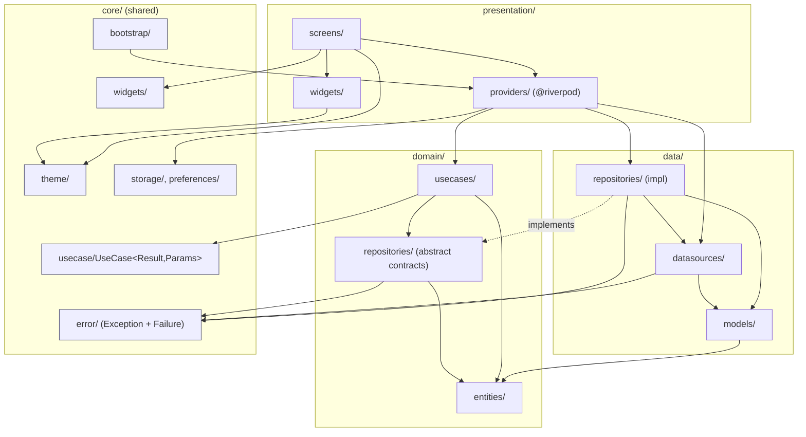
```mermaid
flowchart TB
    subgraph PRES["presentation/"]
        SCR["screens/"]
        WID["widgets/"]
        PRV["providers/ (@riverpod)"]
    end

    subgraph DOM["domain/"]
        ENT["entities/"]
        REPO_I["repositories/ (abstract contracts)"]
        UC["usecases/"]
    end

    subgraph DATA["data/"]
        MODEL["models/"]
        DS["datasources/"]
        REPO_IMPL["repositories/ (impl)"]
    end

    subgraph CORE["core/ (shared)"]
        ERR["error/ (Exception + Failure)"]
        USECASE_BASE["usecase/UseCase&lt;Result,Params&gt;"]
        THEME["theme/"]
        WIDGETS["widgets/"]
        STORAGE["storage/, preferences/"]
        BOOT["bootstrap/"]
    end

    SCR --> WID
    SCR --> PRV
    PRV --> UC
    PRV --> REPO_IMPL
    PRV --> DS
    UC --> REPO_I
    REPO_IMPL -.->|implements| REPO_I
    REPO_IMPL --> DS
    REPO_IMPL --> MODEL
    DS --> MODEL
    MODEL --> ENT
    UC --> ENT
    REPO_I --> ENT

    UC --> USECASE_BASE
    REPO_I --> ERR
    REPO_IMPL --> ERR
    DS --> ERR
    SCR --> THEME
    WID --> THEME
    SCR --> WIDGETS
    BOOT --> PRV
    PRV --> STORAGE

    classDef corecls fill:#eef,stroke:#557
    class ERR,USECASE_BASE,THEME,WIDGETS,STORAGE,BOOT corecls
```

**Dependency rule enforced:** arrows only ever point *inward or sideways
within a layer* — `domain/` never imports from `data/` or
`presentation/`; `data/repositories/*_impl.dart` is what implements the
`domain/repositories/*.dart` contract, not the other way around.

## Cross-cutting: error taxonomy

Every feature throws `core/error/exceptions.dart` types from the data
source only; the repository implementation is the single place that
catches them and maps to a `core/error/failure.dart` value. Everything
above the repository only ever sees `Either<Failure, T>` or a plain
value.

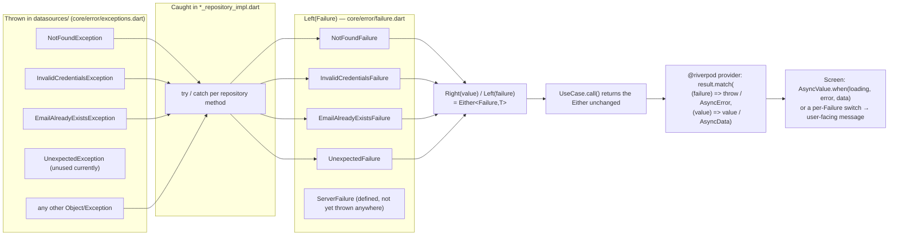
```mermaid
flowchart LR
    subgraph Thrown["Thrown in datasources/ (core/error/exceptions.dart)"]
        E1["NotFoundException"]
        E2["InvalidCredentialsException"]
        E3["EmailAlreadyExistsException"]
        E4["UnexpectedException (unused currently)"]
        E_ANY["any other Object/Exception"]
    end

    subgraph Caught["Caught in *_repository_impl.dart"]
        C["try / catch per repository method"]
    end

    subgraph Mapped["Left(Failure) — core/error/failure.dart"]
        F1["NotFoundFailure"]
        F2["InvalidCredentialsFailure"]
        F3["EmailAlreadyExistsFailure"]
        F4["UnexpectedFailure"]
        F5["ServerFailure (defined, not yet thrown anywhere)"]
    end

    E1 --> C --> F1
    E2 --> C --> F2
    E3 --> C --> F3
    E_ANY --> C --> F4

    F1 & F2 & F3 & F4 --> R["Right(value) / Left(failure)\n= Either&lt;Failure,T&gt;"]
    R --> UC["UseCase.call() returns the Either unchanged"]
    UC --> P["@riverpod provider: result.match(\n  (failure) => throw / AsyncError,\n  (value) => value / AsyncData)"]
    P --> UI["Screen: AsyncValue.when(loading, error, data)\nor a per-Failure switch → user-facing message"]
```

---

## Phase 1 — Theme & Core Widgets

### File/folder structure

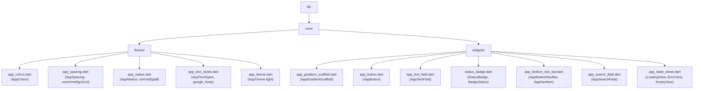
```mermaid
flowchart TD
    LIB["lib/"]
    CORE["core/"]
    THEME_DIR["theme/"]
    WIDGETS_DIR["widgets/"]

    LIB --> CORE
    CORE --> THEME_DIR
    CORE --> WIDGETS_DIR

    THEME_DIR --> t1["app_colors.dart\n(AppColors)"]
    THEME_DIR --> t2["app_spacing.dart\n(AppSpacing: xs/sm/md/lg/xl/xxl)"]
    THEME_DIR --> t3["app_radius.dart\n(AppRadius: sm/md/lg/pill)"]
    THEME_DIR --> t4["app_text_styles.dart\n(AppTextStyles, google_fonts)"]
    THEME_DIR --> t5["app_theme.dart\n(AppTheme.light)"]

    WIDGETS_DIR --> w1["app_gradient_scaffold.dart\n(AppGradientScaffold)"]
    WIDGETS_DIR --> w2["app_button.dart\n(AppButton)"]
    WIDGETS_DIR --> w3["app_text_field.dart\n(AppTextField)"]
    WIDGETS_DIR --> w4["status_badge.dart\n(StatusBadge, BadgeStatus)"]
    WIDGETS_DIR --> w5["app_bottom_nav_bar.dart\n(AppBottomNavBar, AppNavItem)"]
    WIDGETS_DIR --> w6["app_search_field.dart\n(AppSearchField)"]
    WIDGETS_DIR --> w7["app_state_views.dart\n(LoadingView, ErrorView, EmptyView)"]
```

### Class dependency graph

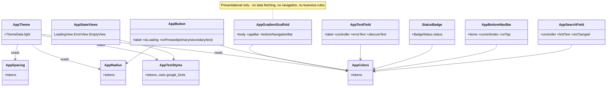
```mermaid
classDiagram
    class AppColors { +tokens }
    class AppSpacing { +tokens }
    class AppRadius { +tokens }
    class AppTextStyles { +tokens, uses google_fonts }
    class AppTheme {
        +ThemeData light
    }
    AppTheme --> AppColors : reads
    AppTheme --> AppSpacing : reads
    AppTheme --> AppRadius : reads
    AppTheme --> AppTextStyles : reads

    class AppGradientScaffold { +body +appBar +bottomNavigationBar }
    class AppButton { +label +isLoading +onPressed (primary/secondary/text) }
    class AppTextField { +label +controller +errorText +obscureText }
    class StatusBadge { +BadgeStatus status }
    class AppBottomNavBar { +items +currentIndex +onTap }
    class AppSearchField { +controller +hintText +onChanged }
    class AppStateViews { LoadingView ErrorView EmptyView }

    AppGradientScaffold --> AppColors
    AppButton --> AppColors
    AppButton --> AppRadius
    AppTextField --> AppColors
    StatusBadge --> AppColors
    AppBottomNavBar --> AppColors
    AppSearchField --> AppColors
    AppStateViews --> AppTextStyles

    note for AppGradientScaffold "Presentational only - no data fetching, no navigation, no business rules"
```

No error flow for this phase — pure presentational tokens/widgets, nothing
throws.

---

## Phase 2 — Books Vertical Slice

### File/folder structure

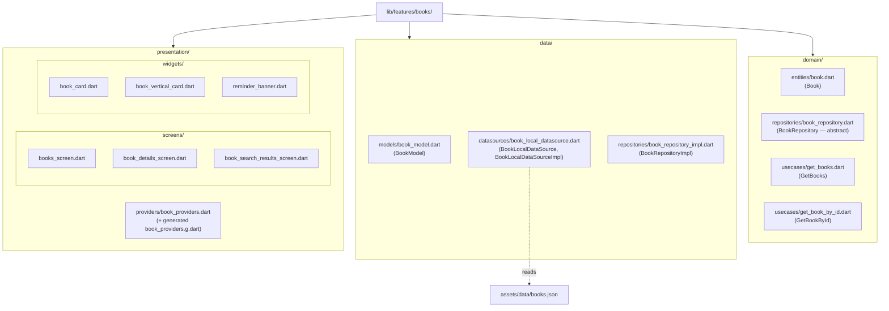
```mermaid
flowchart TD
    BOOKS["lib/features/books/"]

    subgraph DOMAIN["domain/"]
        D_ENT["entities/book.dart\n(Book)"]
        D_REPO["repositories/book_repository.dart\n(BookRepository — abstract)"]
        D_UC1["usecases/get_books.dart\n(GetBooks)"]
        D_UC2["usecases/get_book_by_id.dart\n(GetBookById)"]
    end

    subgraph DATA["data/"]
        DA_MODEL["models/book_model.dart\n(BookModel)"]
        DA_DS["datasources/book_local_datasource.dart\n(BookLocalDataSource, BookLocalDataSourceImpl)"]
        DA_REPO["repositories/book_repository_impl.dart\n(BookRepositoryImpl)"]
    end

    subgraph PRES["presentation/"]
        P_PROV["providers/book_providers.dart\n(+ generated book_providers.g.dart)"]
        subgraph P_SCR["screens/"]
            S1["books_screen.dart"]
            S2["book_details_screen.dart"]
            S3["book_search_results_screen.dart"]
        end
        subgraph P_WID["widgets/"]
            W1["book_card.dart"]
            W2["book_vertical_card.dart"]
            W3["reminder_banner.dart"]
        end
    end

    ASSET["assets/data/books.json"]

    BOOKS --> DOMAIN
    BOOKS --> DATA
    BOOKS --> PRES
    DA_DS -.->|reads| ASSET
```

### Class & function dependency graph

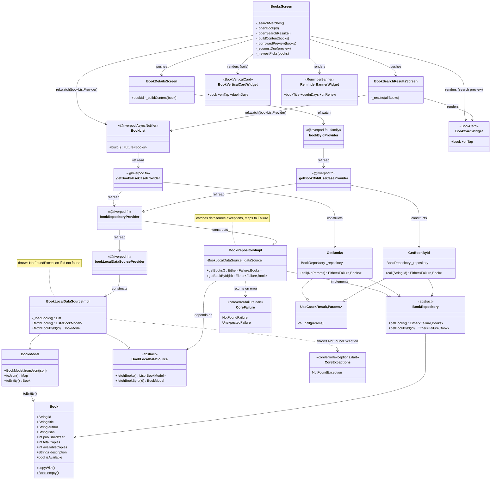
```mermaid
classDiagram
    class Book {
        +String id
        +String title
        +String author
        +String isbn
        +int publishedYear
        +int totalCopies
        +int availableCopies
        +String? description
        +bool isAvailable
        +copyWith()
        +Book.empty()$
    }

    class BookModel {
        +BookModel.fromJson(json)$
        +toJson() Map
        +toEntity() Book
    }
    BookModel --> Book : toEntity()

    class BookRepository {
        <<abstract>>
        +getBooks() Either~Failure,Books~
        +getBookById(id) Either~Failure,Book~
    }
    BookRepository --> Book

    class BookLocalDataSource {
        <<abstract>>
        +fetchBooks() List~BookModel~
        +fetchBookById(id) BookModel
    }
    class BookLocalDataSourceImpl {
        -_loadBooks() List
        +fetchBooks() List~BookModel~
        +fetchBookById(id) BookModel
    }
    BookLocalDataSourceImpl --|> BookLocalDataSource
    BookLocalDataSourceImpl --> BookModel
    note for BookLocalDataSourceImpl "throws NotFoundException if id not found"

    class CoreExceptions {
        <<core/error/exceptions.dart>>
        NotFoundException
    }
    BookLocalDataSourceImpl ..> CoreExceptions : throws NotFoundException

    class BookRepositoryImpl {
        -BookLocalDataSource _dataSource
        +getBooks() Either~Failure,Books~
        +getBookById(id) Either~Failure,Book~
    }
    BookRepositoryImpl --|> BookRepository : implements
    BookRepositoryImpl --> BookLocalDataSource : depends on
    note for BookRepositoryImpl "catches datasource exceptions, maps to Failure"

    class CoreFailure {
        <<core/error/failure.dart>>
        NotFoundFailure
        UnexpectedFailure
    }
    BookRepositoryImpl ..> CoreFailure : returns on error

    class UseCase~Result,Params~ { <<abstract>> +call(params) }
    class GetBooks {
        -BookRepository _repository
        +call(NoParams) Either~Failure,Books~
    }
    class GetBookById {
        -BookRepository _repository
        +call(String id) Either~Failure,Book~
    }
    GetBooks --|> UseCase
    GetBookById --|> UseCase
    GetBooks --> BookRepository
    GetBookById --> BookRepository

    class bookLocalDataSourceProvider { <<@riverpod fn>> }
    class bookRepositoryProvider { <<@riverpod fn>> }
    class getBooksUseCaseProvider { <<@riverpod fn>> }
    class getBookByIdUseCaseProvider { <<@riverpod fn>> }
    class BookList {
        <<@riverpod AsyncNotifier>>
        +build() Future~Books~
    }
    class bookByIdProvider { <<@riverpod fn, .family>> }

    bookLocalDataSourceProvider --> BookLocalDataSourceImpl : constructs
    bookRepositoryProvider --> BookRepositoryImpl : constructs
    bookRepositoryProvider --> bookLocalDataSourceProvider : ref.read
    getBooksUseCaseProvider --> GetBooks : constructs
    getBooksUseCaseProvider --> bookRepositoryProvider : ref.read
    getBookByIdUseCaseProvider --> GetBookById : constructs
    getBookByIdUseCaseProvider --> bookRepositoryProvider : ref.read
    BookList --> getBooksUseCaseProvider : ref.read
    bookByIdProvider --> getBookByIdUseCaseProvider : ref.read

    class BooksScreen {
        -_searchMatches()
        -_openBook(id)
        -_openSearchResults()
        -_buildContent(books)
        -_borrowedPreview(books)
        -_soonestDue(preview)
        -_newestPicks(books)
    }
    class BookDetailsScreen { +bookId -_buildContent(book) }
    class BookSearchResultsScreen { -_results(allBooks) }

    BooksScreen --> BookList : ref.watch(bookListProvider)
    BooksScreen --> BookCardWidget : renders (search preview)
    BooksScreen --> BookVerticalCardWidget : renders (rails)
    BooksScreen --> ReminderBannerWidget : renders
    BooksScreen --> BookDetailsScreen : pushes
    BooksScreen --> BookSearchResultsScreen : pushes
    BookDetailsScreen --> bookByIdProvider : ref.watch
    BookSearchResultsScreen --> BookList : ref.watch(bookListProvider)
    BookSearchResultsScreen --> BookCardWidget : renders

    class BookCardWidget {
        <<BookCard>>
        +book +onTap
    }
    class BookVerticalCardWidget {
        <<BookVerticalCard>>
        +book +onTap +dueInDays
    }
    class ReminderBannerWidget {
        <<ReminderBanner>>
        +bookTitle +dueInDays +onRenew
    }
```

### Runtime + error flow

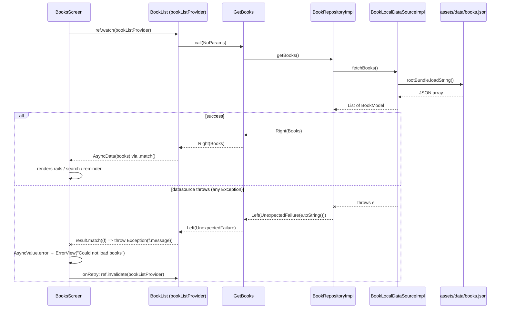
```mermaid
sequenceDiagram
    participant UI as BooksScreen
    participant Prov as BookList (bookListProvider)
    participant UC as GetBooks
    participant Repo as BookRepositoryImpl
    participant DS as BookLocalDataSourceImpl
    participant Asset as assets/data/books.json

    UI->>Prov: ref.watch(bookListProvider)
    Prov->>UC: call(NoParams)
    UC->>Repo: getBooks()
    Repo->>DS: fetchBooks()
    DS->>Asset: rootBundle.loadString()
    Asset-->>DS: JSON array
    DS-->>Repo: List of BookModel

    alt success
        Repo-->>UC: Right(Books)
        UC-->>Prov: Right(Books)
        Prov-->>UI: AsyncData(books) via .match()
        UI->>UI: renders rails / search / reminder
    else datasource throws (any Exception)
        DS--xRepo: throws e
        Repo-->>UC: Left(UnexpectedFailure(e.toString()))
        UC-->>Prov: Left(UnexpectedFailure)
        Prov--xUI: result.match((f) => throw Exception(f.message))
        UI->>UI: AsyncValue.error → ErrorView("Could not load books")
        UI->>Prov: onRetry: ref.invalidate(bookListProvider)
    end
```

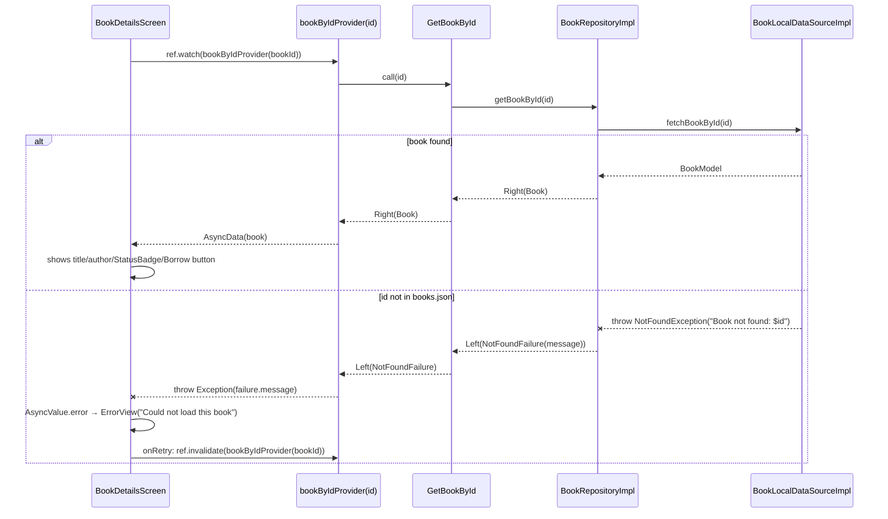
```mermaid
sequenceDiagram
    participant UI as BookDetailsScreen
    participant Prov as bookByIdProvider(id)
    participant UC as GetBookById
    participant Repo as BookRepositoryImpl
    participant DS as BookLocalDataSourceImpl

    UI->>Prov: ref.watch(bookByIdProvider(bookId))
    Prov->>UC: call(id)
    UC->>Repo: getBookById(id)
    Repo->>DS: fetchBookById(id)

    alt book found
        DS-->>Repo: BookModel
        Repo-->>UC: Right(Book)
        UC-->>Prov: Right(Book)
        Prov-->>UI: AsyncData(book)
        UI->>UI: shows title/author/StatusBadge/Borrow button
    else id not in books.json
        DS--xRepo: throw NotFoundException("Book not found: $id")
        Repo-->>UC: Left(NotFoundFailure(message))
        UC-->>Prov: Left(NotFoundFailure)
        Prov--xUI: throw Exception(failure.message)
        UI->>UI: AsyncValue.error → ErrorView("Could not load this book")
        UI->>Prov: onRetry: ref.invalidate(bookByIdProvider(bookId))
    end
```

---

## Phase 3 — Auth Vertical Slice

### File/folder structure

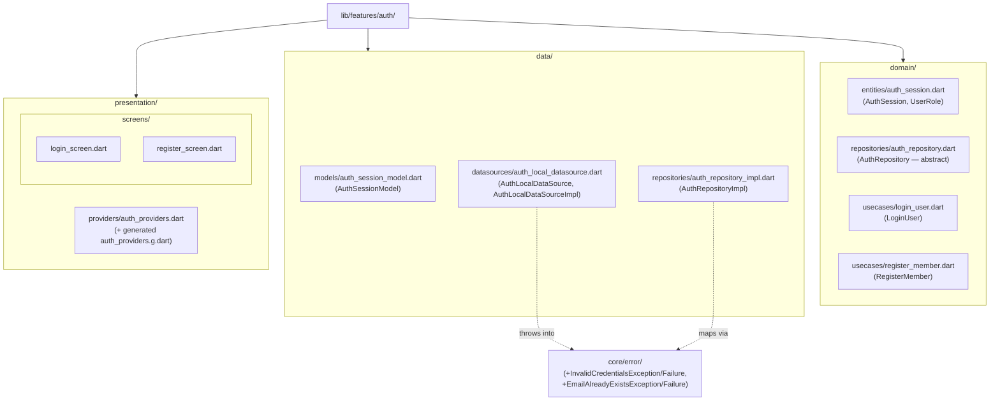
```mermaid
flowchart TD
    AUTH["lib/features/auth/"]

    subgraph DOMAIN["domain/"]
        D_ENT["entities/auth_session.dart\n(AuthSession, UserRole)"]
        D_REPO["repositories/auth_repository.dart\n(AuthRepository — abstract)"]
        D_UC1["usecases/login_user.dart\n(LoginUser)"]
        D_UC2["usecases/register_member.dart\n(RegisterMember)"]
    end

    subgraph DATA["data/"]
        DA_MODEL["models/auth_session_model.dart\n(AuthSessionModel)"]
        DA_DS["datasources/auth_local_datasource.dart\n(AuthLocalDataSource, AuthLocalDataSourceImpl)"]
        DA_REPO["repositories/auth_repository_impl.dart\n(AuthRepositoryImpl)"]
    end

    subgraph PRES["presentation/"]
        P_PROV["providers/auth_providers.dart\n(+ generated auth_providers.g.dart)"]
        subgraph P_SCR["screens/"]
            S1["login_screen.dart"]
            S2["register_screen.dart"]
        end
    end

    CORE_ERR["core/error/\n(+InvalidCredentialsException/Failure,\n+EmailAlreadyExistsException/Failure)"]

    AUTH --> DOMAIN
    AUTH --> DATA
    AUTH --> PRES
    DA_DS -.->|throws into| CORE_ERR
    DA_REPO -.->|maps via| CORE_ERR
```

### Class & function dependency graph

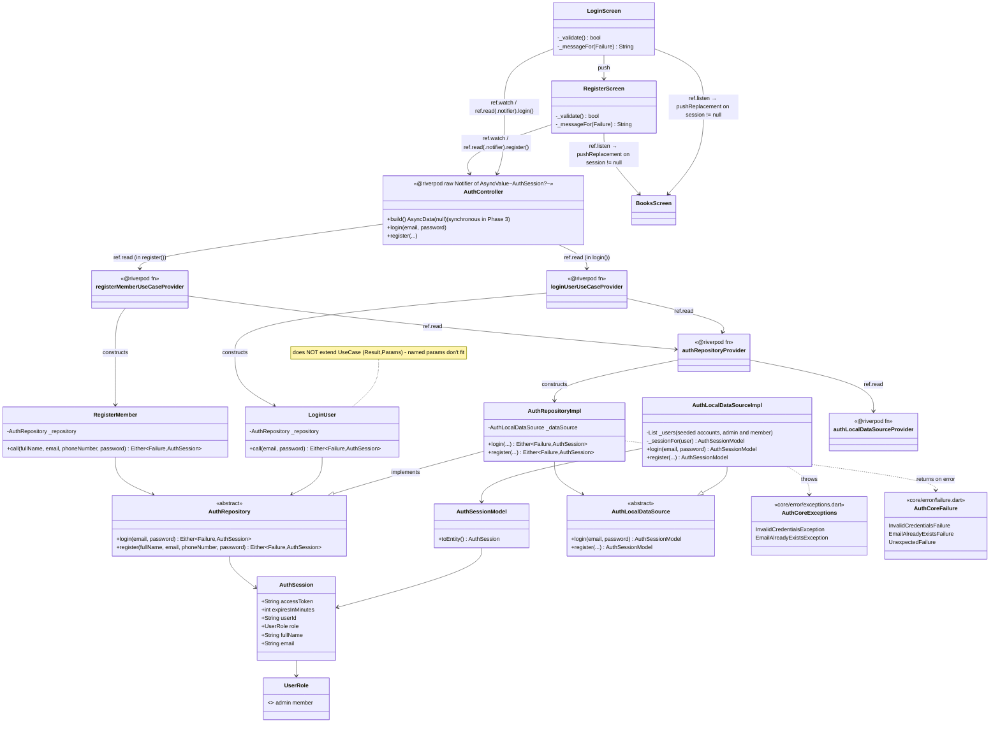
```mermaid
classDiagram
    class AuthSession {
        +String accessToken
        +int expiresInMinutes
        +String userId
        +UserRole role
        +String fullName
        +String email
    }
    class UserRole { <<enum>> admin member }
    AuthSession --> UserRole

    class AuthSessionModel {
        +toEntity() AuthSession
    }
    AuthSessionModel --> AuthSession

    class AuthRepository {
        <<abstract>>
        +login(email, password) Either~Failure,AuthSession~
        +register(fullName, email, phoneNumber, password) Either~Failure,AuthSession~
    }
    AuthRepository --> AuthSession

    class AuthLocalDataSource {
        <<abstract>>
        +login(email, password) AuthSessionModel
        +register(...) AuthSessionModel
    }
    class AuthLocalDataSourceImpl {
        -List _users (seeded accounts, admin and member)
        -_sessionFor(user) AuthSessionModel
        +login(email, password) AuthSessionModel
        +register(...) AuthSessionModel
    }
    AuthLocalDataSourceImpl --|> AuthLocalDataSource
    AuthLocalDataSourceImpl --> AuthSessionModel

    class AuthCoreExceptions {
        <<core/error/exceptions.dart>>
        InvalidCredentialsException
        EmailAlreadyExistsException
    }
    AuthLocalDataSourceImpl ..> AuthCoreExceptions : throws

    class AuthRepositoryImpl {
        -AuthLocalDataSource _dataSource
        +login(...) Either~Failure,AuthSession~
        +register(...) Either~Failure,AuthSession~
    }
    AuthRepositoryImpl --|> AuthRepository : implements
    AuthRepositoryImpl --> AuthLocalDataSource

    class AuthCoreFailure {
        <<core/error/failure.dart>>
        InvalidCredentialsFailure
        EmailAlreadyExistsFailure
        UnexpectedFailure
    }
    AuthRepositoryImpl ..> AuthCoreFailure : returns on error

    class LoginUser {
        -AuthRepository _repository
        +call(email, password) Either~Failure,AuthSession~
    }
    note for LoginUser "does NOT extend UseCase (Result,Params) - named params don't fit"
    class RegisterMember {
        -AuthRepository _repository
        +call(fullName, email, phoneNumber, password) Either~Failure,AuthSession~
    }
    LoginUser --> AuthRepository
    RegisterMember --> AuthRepository

    class authLocalDataSourceProvider { <<@riverpod fn>> }
    class authRepositoryProvider { <<@riverpod fn>> }
    class loginUserUseCaseProvider { <<@riverpod fn>> }
    class registerMemberUseCaseProvider { <<@riverpod fn>> }
    class AuthController {
        <<@riverpod raw Notifier of AsyncValue~AuthSession?~>>
        +build() AsyncData(null) (synchronous in Phase 3)
        +login(email, password)
        +register(...)
    }

    authRepositoryProvider --> authLocalDataSourceProvider : ref.read
    authRepositoryProvider --> AuthRepositoryImpl : constructs
    loginUserUseCaseProvider --> LoginUser : constructs
    loginUserUseCaseProvider --> authRepositoryProvider : ref.read
    registerMemberUseCaseProvider --> RegisterMember : constructs
    registerMemberUseCaseProvider --> authRepositoryProvider : ref.read
    AuthController --> loginUserUseCaseProvider : ref.read (in login())
    AuthController --> registerMemberUseCaseProvider : ref.read (in register())

    class LoginScreen {
        -_validate() bool
        -_messageFor(Failure) String
    }
    class RegisterScreen {
        -_validate() bool
        -_messageFor(Failure) String
    }
    LoginScreen --> AuthController : ref.watch / ref.read(.notifier).login()
    LoginScreen --> BooksScreen : ref.listen → pushReplacement on session != null
    LoginScreen --> RegisterScreen : push
    RegisterScreen --> AuthController : ref.watch / ref.read(.notifier).register()
    RegisterScreen --> BooksScreen : ref.listen → pushReplacement on session != null
```

> **Superseded by [Phase 5](#phase-5--go_router-migration-auth-stack--main-stack).**
> Neither screen navigates on success anymore, and `LoginScreen` no
> longer references `RegisterScreen` directly — both are go_router
> routes now.

### Runtime + error flow

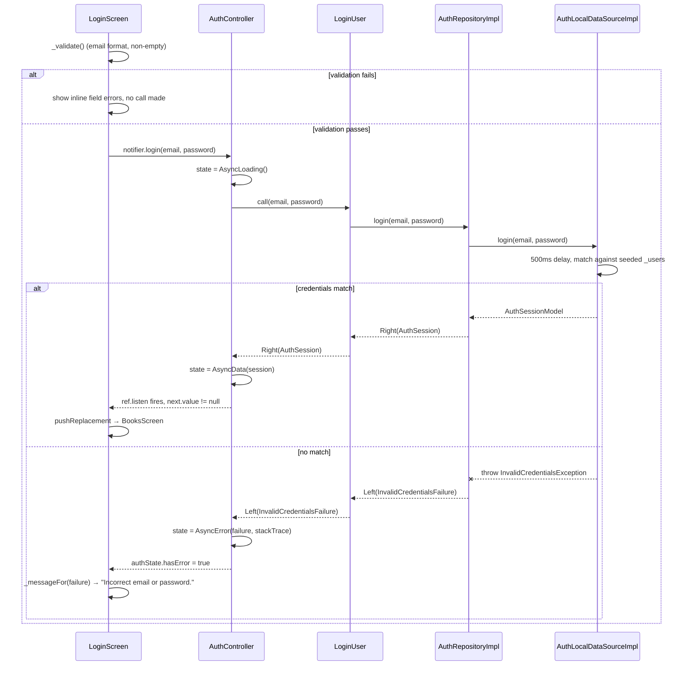
```mermaid
sequenceDiagram
    participant UI as LoginScreen
    participant Ctrl as AuthController
    participant UC as LoginUser
    participant Repo as AuthRepositoryImpl
    participant DS as AuthLocalDataSourceImpl

    UI->>UI: _validate() (email format, non-empty)
    alt validation fails
        UI->>UI: show inline field errors, no call made
    else validation passes
        UI->>Ctrl: notifier.login(email, password)
        Ctrl->>Ctrl: state = AsyncLoading()
        Ctrl->>UC: call(email, password)
        UC->>Repo: login(email, password)
        Repo->>DS: login(email, password)
        DS->>DS: 500ms delay, match against seeded _users

        alt credentials match
            DS-->>Repo: AuthSessionModel
            Repo-->>UC: Right(AuthSession)
            UC-->>Ctrl: Right(AuthSession)
            Ctrl->>Ctrl: state = AsyncData(session)
            Ctrl-->>UI: ref.listen fires, next.value != null
            UI->>UI: pushReplacement → BooksScreen
        else no match
            DS--xRepo: throw InvalidCredentialsException
            Repo-->>UC: Left(InvalidCredentialsFailure)
            UC-->>Ctrl: Left(InvalidCredentialsFailure)
            Ctrl->>Ctrl: state = AsyncError(failure, stackTrace)
            Ctrl-->>UI: authState.hasError = true
            UI->>UI: _messageFor(failure) → "Incorrect email or password."
        end
    end
```

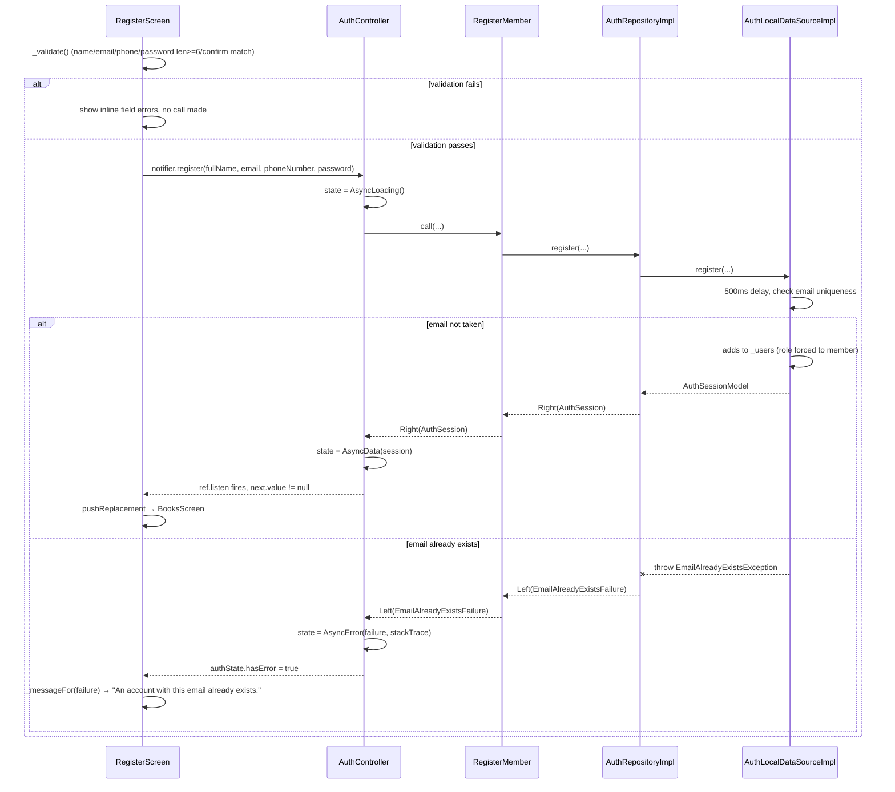
```mermaid
sequenceDiagram
    participant UI as RegisterScreen
    participant Ctrl as AuthController
    participant UC as RegisterMember
    participant Repo as AuthRepositoryImpl
    participant DS as AuthLocalDataSourceImpl

    UI->>UI: _validate() (name/email/phone/password len>=6/confirm match)
    alt validation fails
        UI->>UI: show inline field errors, no call made
    else validation passes
        UI->>Ctrl: notifier.register(fullName, email, phoneNumber, password)
        Ctrl->>Ctrl: state = AsyncLoading()
        Ctrl->>UC: call(...)
        UC->>Repo: register(...)
        Repo->>DS: register(...)
        DS->>DS: 500ms delay, check email uniqueness

        alt email not taken
            DS->>DS: adds to _users (role forced to member)
            DS-->>Repo: AuthSessionModel
            Repo-->>UC: Right(AuthSession)
            UC-->>Ctrl: Right(AuthSession)
            Ctrl->>Ctrl: state = AsyncData(session)
            Ctrl-->>UI: ref.listen fires, next.value != null
            UI->>UI: pushReplacement → BooksScreen
        else email already exists
            DS--xRepo: throw EmailAlreadyExistsException
            Repo-->>UC: Left(EmailAlreadyExistsFailure)
            UC-->>Ctrl: Left(EmailAlreadyExistsFailure)
            Ctrl->>Ctrl: state = AsyncError(failure, stackTrace)
            Ctrl-->>UI: authState.hasError = true
            UI->>UI: _messageFor(failure) → "An account with this email already exists."
        end
    end
```

### AuthController state machine

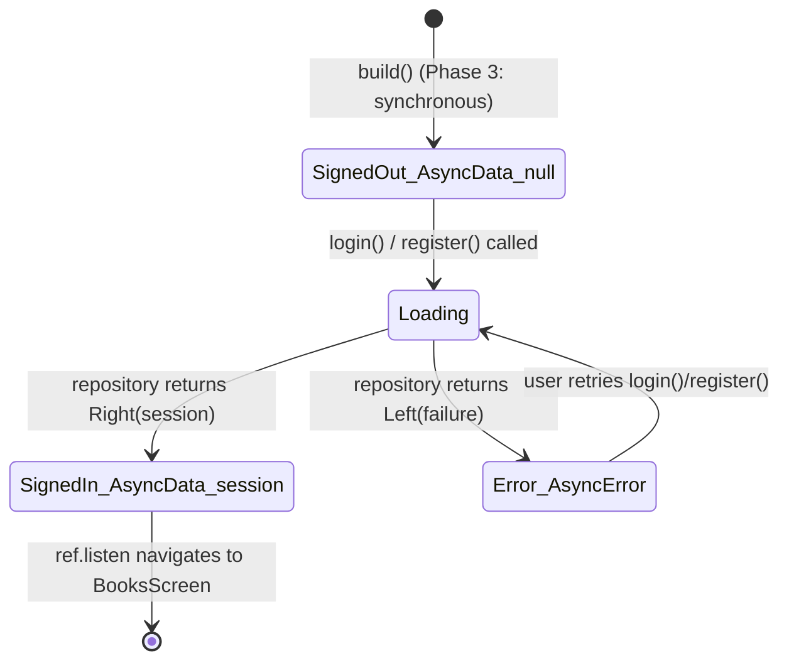
```mermaid
stateDiagram-v2
    [*] --> SignedOut_AsyncData_null : build() (Phase 3: synchronous)
    SignedOut_AsyncData_null --> Loading : login() / register() called
    Loading --> SignedIn_AsyncData_session : repository returns Right(session)
    Loading --> Error_AsyncError : repository returns Left(failure)
    Error_AsyncError --> Loading : user retries login()/register()
    SignedIn_AsyncData_session --> [*] : ref.listen navigates to BooksScreen
```

---

## Phase 4 — Session Persistence, Onboarding Gate, Splash Wiring

### File/folder structure

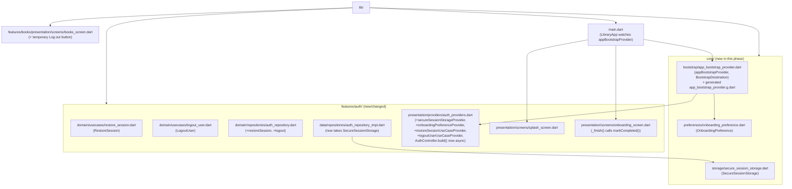
```mermaid
flowchart TD
    LIB["lib/"]

    subgraph CORE_NEW["core/ (new in this phase)"]
        STOR["storage/secure_session_storage.dart\n(SecureSessionStorage)"]
        PREF["preferences/onboarding_preference.dart\n(OnboardingPreference)"]
        BOOT["bootstrap/app_bootstrap_provider.dart\n(appBootstrapProvider, BootstrapDestination)\n+ generated app_bootstrap_provider.g.dart"]
    end

    subgraph AUTH_NEW["features/auth/ (new/changed)"]
        UC3["domain/usecases/restore_session.dart\n(RestoreSession)"]
        UC4["domain/usecases/logout_user.dart\n(LogoutUser)"]
        REPO_C["domain/repositories/auth_repository.dart\n(+restoreSession, +logout)"]
        REPO_IMPL_C["data/repositories/auth_repository_impl.dart\n(now takes SecureSessionStorage)"]
        PROV_C["presentation/providers/auth_providers.dart\n(+secureSessionStorageProvider,\n+onboardingPreferenceProvider,\n+restoreSessionUseCaseProvider,\n+logoutUserUseCaseProvider,\nAuthController.build() now async)"]
        SPLASH["presentation/screens/splash_screen.dart"]
        ONBOARD["presentation/screens/onboarding_screen.dart\n(_finish() calls markCompleted())"]
    end

    BOOKS_C["features/books/presentation/screens/books_screen.dart\n(+ temporary Log out button)"]
    MAIN["main.dart\n(LibraryApp watches appBootstrapProvider)"]

    LIB --> CORE_NEW
    LIB --> AUTH_NEW
    LIB --> BOOKS_C
    LIB --> MAIN

    BOOT --> PREF
    BOOT --> PROV_C
    REPO_IMPL_C --> STOR
    MAIN --> BOOT
    MAIN --> SPLASH
    MAIN --> ONBOARD
```

### Class & function dependency graph

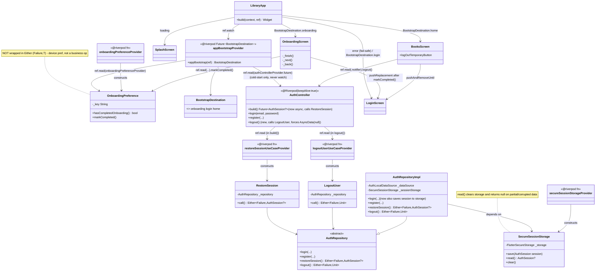
```mermaid
classDiagram
    class SecureSessionStorage {
        -FlutterSecureStorage _storage
        +save(AuthSession session)
        +read() AuthSession?
        +clear()
    }
    note for SecureSessionStorage "read() clears storage and returns null on partial/corrupted data"

    class OnboardingPreference {
        -_key String
        +hasCompletedOnboarding() bool
        +markCompleted()
    }
    note for OnboardingPreference "NOT wrapped in Either (Failure,T) - device pref, not a business op"

    class BootstrapDestination { <<enum>> onboarding login home }
    class appBootstrapProvider {
        <<@riverpod Future~BootstrapDestination~>>
        +appBootstrap(ref) BootstrapDestination
    }
    appBootstrapProvider --> OnboardingPreference : ref.read(onboardingPreferenceProvider)
    appBootstrapProvider --> BootstrapDestination
    appBootstrapProvider --> AuthController : ref.read(authControllerProvider.future) (cold-start only, never watch)

    class RestoreSession {
        -AuthRepository _repository
        +call() Either~Failure,AuthSession?~
    }
    class LogoutUser {
        -AuthRepository _repository
        +call() Either~Failure,Unit~
    }
    RestoreSession --> AuthRepository
    LogoutUser --> AuthRepository

    class AuthRepository {
        <<abstract>>
        +login(...)
        +register(...)
        +restoreSession() Either~Failure,AuthSession?~
        +logout() Either~Failure,Unit~
    }

    class AuthRepositoryImpl {
        -AuthLocalDataSource _dataSource
        -SecureSessionStorage _sessionStorage
        +login(...) (now also saves session to storage)
        +register(...)
        +restoreSession() Either~Failure,AuthSession?~
        +logout() Either~Failure,Unit~
    }
    AuthRepositoryImpl --|> AuthRepository
    AuthRepositoryImpl --> SecureSessionStorage : depends on

    class secureSessionStorageProvider { <<@riverpod fn>> }
    class onboardingPreferenceProvider { <<@riverpod fn>> }
    class restoreSessionUseCaseProvider { <<@riverpod fn>> }
    class logoutUserUseCaseProvider { <<@riverpod fn>> }
    secureSessionStorageProvider --> SecureSessionStorage : constructs
    onboardingPreferenceProvider --> OnboardingPreference : constructs
    restoreSessionUseCaseProvider --> RestoreSession : constructs
    logoutUserUseCaseProvider --> LogoutUser : constructs

    class AuthController {
        <<@Riverpod(keepAlive:true)>>
        +build() Future~AuthSession?~ (now async, calls RestoreSession)
        +login(email, password)
        +register(...)
        +logout() (new, calls LogoutUser, forces AsyncData(null))
    }
    AuthController --> restoreSessionUseCaseProvider : ref.read (in build())
    AuthController --> logoutUserUseCaseProvider : ref.read (in logout())

    class LibraryApp {
        +build(context, ref) Widget
    }
    LibraryApp --> appBootstrapProvider : ref.watch
    LibraryApp --> SplashScreen : loading
    LibraryApp --> LoginScreen : error (fail-safe) / BootstrapDestination.login
    LibraryApp --> OnboardingScreen : BootstrapDestination.onboarding
    LibraryApp --> BooksScreen : BootstrapDestination.home

    class OnboardingScreen {
        -_finish()
        -_next()
        -_back()
    }
    OnboardingScreen --> OnboardingPreference : ref.read(...).markCompleted()
    OnboardingScreen --> LoginScreen : pushReplacement after markCompleted()

    class BooksScreen {
        +logOutTemporaryButton
    }
    BooksScreen --> AuthController : ref.read(.notifier).logout()
    BooksScreen --> LoginScreen : pushAndRemoveUntil
```

> **Superseded by [Phase 5](#phase-5--go_router-migration-auth-stack--main-stack).**
> `LibraryApp`, `OnboardingScreen`, and `BooksScreen` no longer reference
> `LoginScreen`/`BooksScreen`/`OnboardingScreen` by type or call
> `Navigator` at all — every one of those edges is now a go_router
> route/`redirect`.

### Runtime + error flow: cold-start bootstrap

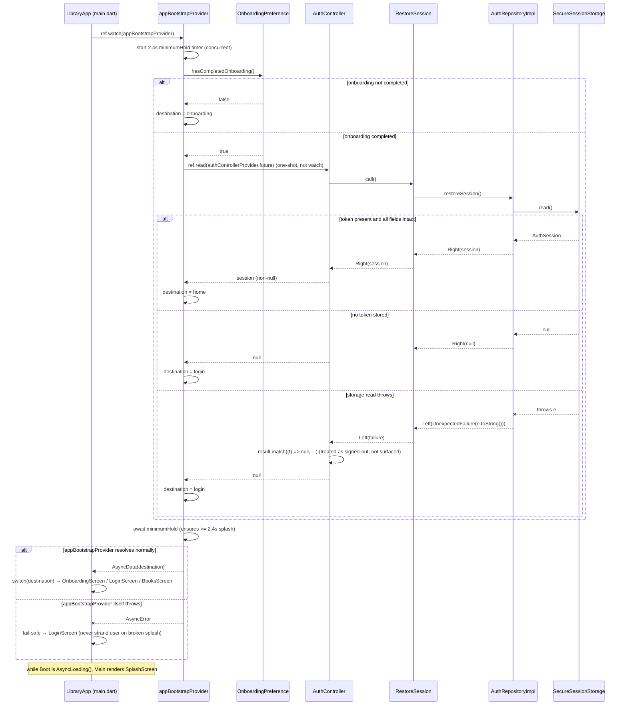
```mermaid
sequenceDiagram
    participant Main as LibraryApp (main.dart)
    participant Boot as appBootstrapProvider
    participant OnbPref as OnboardingPreference
    participant Auth as AuthController
    participant Restore as RestoreSession
    participant Repo as AuthRepositoryImpl
    participant Storage as SecureSessionStorage

    Main->>Boot: ref.watch(appBootstrapProvider)
    Boot->>Boot: start 2.4s minimumHold timer (concurrent)
    Boot->>OnbPref: hasCompletedOnboarding()

    alt onboarding not completed
        OnbPref-->>Boot: false
        Boot->>Boot: destination = onboarding
    else onboarding completed
        OnbPref-->>Boot: true
        Boot->>Auth: ref.read(authControllerProvider.future) (one-shot, not watch)
        Auth->>Restore: call()
        Restore->>Repo: restoreSession()
        Repo->>Storage: read()

        alt token present and all fields intact
            Storage-->>Repo: AuthSession
            Repo-->>Restore: Right(session)
            Restore-->>Auth: Right(session)
            Auth-->>Boot: session (non-null)
            Boot->>Boot: destination = home
        else no token stored
            Storage-->>Repo: null
            Repo-->>Restore: Right(null)
            Auth-->>Boot: null
            Boot->>Boot: destination = login
        else storage read throws
            Storage--xRepo: throws e
            Repo-->>Restore: Left(UnexpectedFailure(e.toString()))
            Restore-->>Auth: Left(failure)
            Auth->>Auth: result.match((f) => null, ...) (treated as signed-out, not surfaced)
            Auth-->>Boot: null
            Boot->>Boot: destination = login
        end
    end

    Boot->>Boot: await minimumHold (ensures >= 2.4s splash)

    alt appBootstrapProvider resolves normally
        Boot-->>Main: AsyncData(destination)
        Main->>Main: switch(destination) → OnboardingScreen / LoginScreen / BooksScreen
    else appBootstrapProvider itself throws
        Boot--xMain: AsyncError
        Main->>Main: fail-safe → LoginScreen (never strand user on broken splash)
    end

    Note over Main: while Boot is AsyncLoading(), Main renders SplashScreen
```

### Runtime + error flow: corrupted secure storage

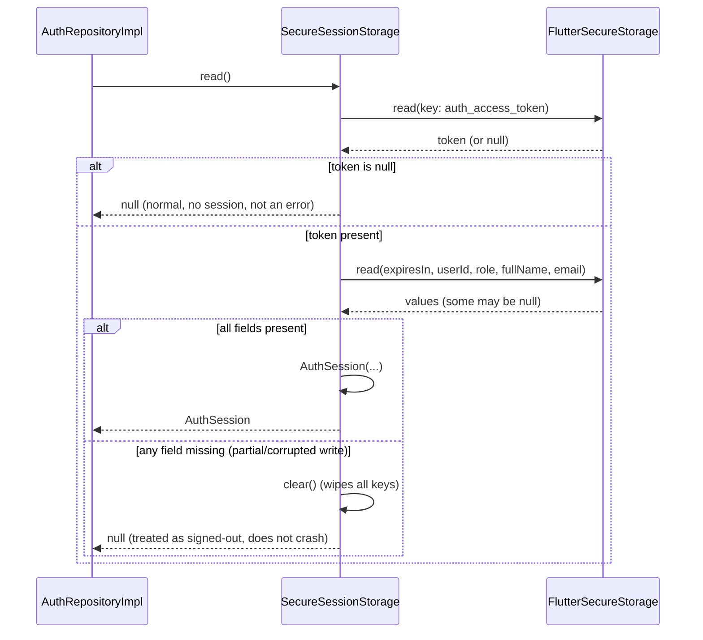
```mermaid
sequenceDiagram
    participant Repo as AuthRepositoryImpl
    participant Storage as SecureSessionStorage
    participant Backend as FlutterSecureStorage

    Repo->>Storage: read()
    Storage->>Backend: read(key: auth_access_token)
    Backend-->>Storage: token (or null)

    alt token is null
        Storage-->>Repo: null (normal, no session, not an error)
    else token present
        Storage->>Backend: read(expiresIn, userId, role, fullName, email)
        Backend-->>Storage: values (some may be null)

        alt all fields present
            Storage->>Storage: AuthSession(...)
            Storage-->>Repo: AuthSession
        else any field missing (partial/corrupted write)
            Storage->>Storage: clear() (wipes all keys)
            Storage-->>Repo: null (treated as signed-out, does not crash)
        end
    end
```

### App-level navigation states

> **Superseded by [Phase 5](#phase-5--go_router-migration-auth-stack--main-stack)**,
> which replaces every `ref.listen`/`pushReplacement`/`pushAndRemoveUntil`
> edge below with a single declarative `redirect`. Kept here as the
> historical record of this phase's implementation.

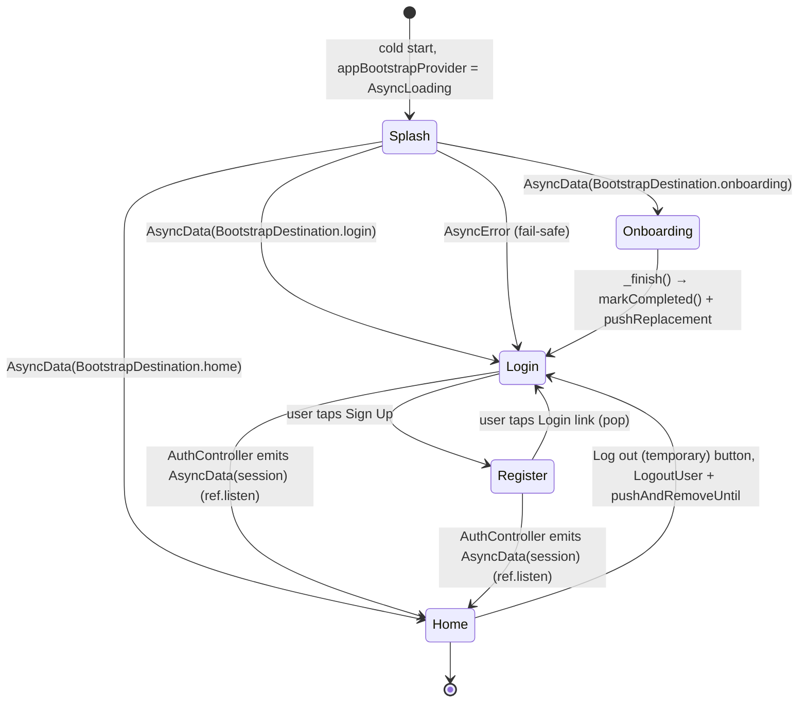
```mermaid
stateDiagram-v2
    [*] --> Splash : cold start, appBootstrapProvider = AsyncLoading
    Splash --> Onboarding : AsyncData(BootstrapDestination.onboarding)
    Splash --> Login : AsyncData(BootstrapDestination.login)
    Splash --> Home : AsyncData(BootstrapDestination.home)
    Splash --> Login : AsyncError (fail-safe)

    Onboarding --> Login : _finish() → markCompleted() + pushReplacement

    Login --> Home : AuthController emits AsyncData(session) (ref.listen)
    Login --> Register : user taps Sign Up
    Register --> Login : user taps Login link (pop)
    Register --> Home : AuthController emits AsyncData(session) (ref.listen)

    Home --> Login : Log out (temporary) button, LogoutUser + pushAndRemoveUntil

    Home --> [*]
```

---

## Phase 5 — go_router Migration (Auth Stack / Main Stack)

Phase 4 (and a short-lived unnamed `AuthGate` widget that came right
after it, never diagrammed) got the *effect* of "can't navigate back
into auth once signed in" right, but each screen carried its own
imperative `Navigator` call to make that true — `RegisterScreen` popped
itself when it saw a session appear, `OnboardingScreen` pushed
`AuthGate` by hand, `BooksScreen`'s logout button called
`pushAndRemoveUntil`. Nothing declaratively owned the whole flow.

This phase replaces all of that with **go_router**: a real two-branch
route topology — an **Auth Stack** (`/login`, `/login/register`) and a
**Main Stack** (`/home`, `/home/book/:id`, `/home/search`) — guarded by
one `redirect` function. No screen navigates to Home or back to Login on
its own anymore; changing `authControllerProvider`'s state is enough, and
the router is the only thing that reacts. A single `GoRouter`/root
`Navigator` (no `ShellRoute`/nested Navigators) is sufficient because the
two branches are mutually exclusive by design — there's no guest
browsing, so Main is never reachable pre-auth and the two stacks are
never shown together.

### File/folder structure

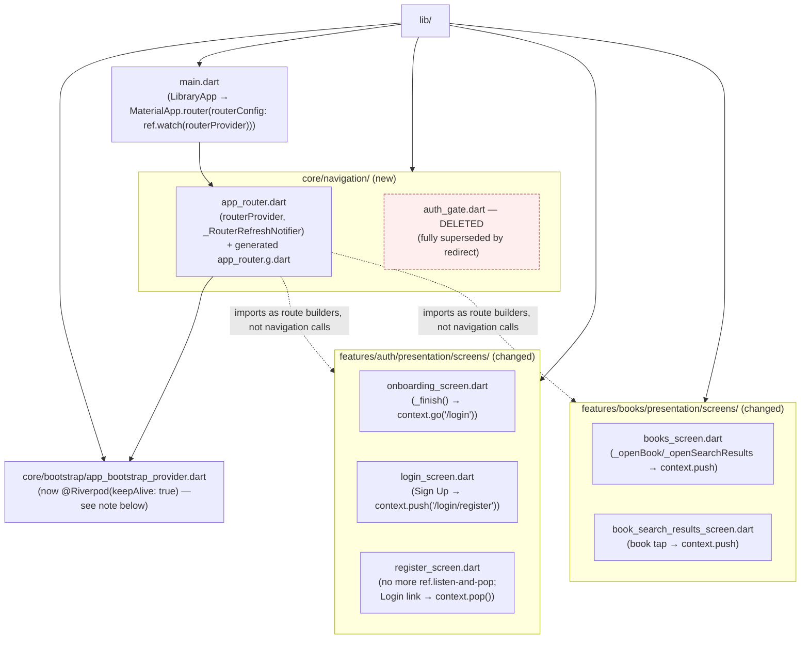
```mermaid
flowchart TD
    LIB["lib/"]

    subgraph CORE_NAV["core/navigation/ (new)"]
        ROUTER["app_router.dart\n(routerProvider, _RouterRefreshNotifier)\n+ generated app_router.g.dart"]
        GATE["auth_gate.dart — DELETED\n(fully superseded by redirect)"]
    end

    BOOT_C["core/bootstrap/app_bootstrap_provider.dart\n(now @Riverpod(keepAlive: true) —\nsee note below)"]
    MAIN_C["main.dart\n(LibraryApp → MaterialApp.router(routerConfig: ref.watch(routerProvider)))"]

    subgraph AUTH_C["features/auth/presentation/screens/ (changed)"]
        ONB_C["onboarding_screen.dart\n(_finish() → context.go('/login'))"]
        LOGIN_C["login_screen.dart\n(Sign Up → context.push('/login/register'))"]
        REG_C["register_screen.dart\n(no more ref.listen-and-pop;\nLogin link → context.pop())"]
    end

    subgraph BOOKS_C["features/books/presentation/screens/ (changed)"]
        BOOKS_S["books_screen.dart\n(_openBook/_openSearchResults → context.push)"]
        SEARCH_S["book_search_results_screen.dart\n(book tap → context.push)"]
    end

    LIB --> CORE_NAV
    LIB --> BOOT_C
    LIB --> MAIN_C
    LIB --> AUTH_C
    LIB --> BOOKS_C
    MAIN_C --> ROUTER
    ROUTER --> BOOT_C
    ROUTER -.->|imports as route builders, not navigation calls| AUTH_C
    ROUTER -.->|imports as route builders, not navigation calls| BOOKS_C

    classDef removed fill:#fee,stroke:#a55,stroke-dasharray: 4 2
    class GATE removed
```

### Class & function dependency graph

```mermaid
classDiagram
    class _RouterRefreshNotifier {
        <<ChangeNotifier>>
        +ping()
    }
    note for _RouterRefreshNotifier "notifyListeners() is @protected — ping() is the only public trigger, called from the two ref.listen callbacks below"

    class routerProvider {
        <<@Riverpod(keepAlive: true) GoRouter fn>>
        -redirect(context, state) String?
    }
    routerProvider --> _RouterRefreshNotifier : constructs, passes as refreshListenable
    routerProvider --> appBootstrapProvider : ref.listen (drives refresh + keeps it alive) and ref.read (inside redirect)
    routerProvider --> AuthController : ref.listen (drives refresh) and ref.read (inside redirect, via authControllerProvider)

    class appBootstrapProvider {
        <<@Riverpod(keepAlive: true) Future~BootstrapDestination~ fn>>
        note "keepAlive added this phase — previously relied on\nLibraryApp's ref.watch to stay alive; now that\nMain.dart no longer watches it directly, this must\nown its own lifetime so it never recomputes\n(and replays its 2.4s hold) after cold start"
    }

    class GoRouter {
        <<routes>>
        "/splash" --> SplashScreen
        "/onboarding" --> OnboardingScreen
        "/login" --> LoginScreen
        "/login/register" --> RegisterScreen
        "/home" --> BooksScreen
        "/home/book/:id" --> BookDetailsScreen
        "/home/search?q=" --> BookSearchResultsScreen
    }
    routerProvider --> GoRouter : constructs

    class LibraryApp {
        +build(context, ref) Widget
    }
    LibraryApp --> routerProvider : ref.watch → MaterialApp.router(routerConfig)

    class OnboardingScreen { -_finish() }
    OnboardingScreen ..> GoRouter : context.go('/login')

    class LoginScreen
    LoginScreen ..> GoRouter : context.push('/login/register')

    class RegisterScreen
    RegisterScreen ..> GoRouter : context.pop()
    note for RegisterScreen "No longer listens to AuthController or navigates on success — redirect re-evaluates the CURRENT location (even /login/register) whenever authControllerProvider changes, and fully replaces it with /home"

    class BooksScreen { -_openBook(id) -_openSearchResults() }
    BooksScreen ..> GoRouter : context.push('/home/book/$id'), context.push(Uri(path:'/home/search', queryParameters:{'q':_query}))
    note for BooksScreen "Logout button unchanged — still navigation-free; redirect handles the swap back to /login"

    class BookSearchResultsScreen
    BookSearchResultsScreen ..> GoRouter : context.push('/home/book/${book.id}')
```

### Runtime + redirect flow

```mermaid
sequenceDiagram
    participant Flutter as Router/Flutter (refreshListenable fires)
    participant Redirect as routerProvider.redirect()
    participant Boot as appBootstrapProvider (ref.read)
    participant Auth as authControllerProvider (ref.read)

    Note over Flutter: cold start, initialLocation = /splash
    Flutter->>Redirect: evaluate('/splash')
    Redirect->>Boot: ref.read → AsyncLoading
    Redirect-->>Flutter: null (loc already /splash, no redirect)
    Flutter->>Flutter: renders SplashScreen

    Boot-->>Redirect: (later) resolves → AsyncData(destination), refresh.ping() fires
    Flutter->>Redirect: evaluate('/splash') again
    Redirect->>Boot: ref.read → AsyncData(destination)

    alt destination == onboarding
        Redirect-->>Flutter: '/onboarding'
    else destination == login or home
        Redirect->>Auth: ref.read → signedIn?
        Redirect-->>Flutter: signedIn ? '/home' : '/login'
    end
    Note over Redirect: this /splash branch is one-shot — never\nconsulted again once loc leaves /splash
```

```mermaid
sequenceDiagram
    participant UI as LoginScreen (at /login)
    participant Ctrl as AuthController
    participant Refresh as _RouterRefreshNotifier
    participant Redirect as routerProvider.redirect()

    UI->>Ctrl: notifier.login(email, password)
    Ctrl->>Ctrl: state = AsyncLoading()
    Note over Redirect: signedIn=false, onLoginBranch=true → no redirect, stays on /login showing spinner

    Ctrl->>Ctrl: state = AsyncData(session) (login succeeded)
    Ctrl-->>Refresh: ref.listen fires → refresh.ping()
    Refresh-->>Redirect: refreshListenable notifies → re-evaluate current location ('/login')
    Redirect->>Redirect: signedIn=true, onLoginBranch=true → return '/home'
    Redirect-->>UI: entire location replaced with /home; /login discarded from history
```

```mermaid
sequenceDiagram
    participant UI as RegisterScreen (at /login/register)
    participant Ctrl as AuthController
    participant Refresh as _RouterRefreshNotifier
    participant Redirect as routerProvider.redirect()

    UI->>Ctrl: notifier.register(...)
    Ctrl->>Ctrl: state = AsyncData(session) (sign-up succeeded)
    Ctrl-->>Refresh: ref.listen fires → refresh.ping()
    Refresh-->>Redirect: re-evaluate current location ('/login/register')
    Redirect->>Redirect: onLoginBranch=true (startsWith '/login/'), signedIn=true → return '/home'
    Redirect-->>UI: /login AND /login/register both discarded; /home is the entire new location

    Note over UI,Redirect: This is the case Phase 4's RegisterScreen needed a manual\nref.listen+pop for. redirect re-runs against whatever the\nCURRENT location is (not just on fresh navigations), so the\nsub-route being on top of the stack doesn't block the swap.
```

```mermaid
sequenceDiagram
    participant UI as BooksScreen (at /home)
    participant Ctrl as AuthController
    participant Refresh as _RouterRefreshNotifier
    participant Redirect as routerProvider.redirect()

    UI->>Ctrl: notifier.logout()
    Ctrl->>Ctrl: state = AsyncData(null)
    Ctrl-->>Refresh: ref.listen fires → refresh.ping()
    Refresh-->>Redirect: re-evaluate current location ('/home')
    Redirect->>Redirect: signedIn=false, onHomeBranch=true → return '/login'
    Redirect-->>UI: /home discarded; /login is the entire new location
```

### App-level navigation states (go_router)

```mermaid
stateDiagram-v2
    [*] --> Splash : initialLocation = /splash, appBootstrapProvider = AsyncLoading
    Splash --> Splash : redirect: bootstrap.isLoading, loc already /splash → no-op
    Splash --> Onboarding : redirect: destination == onboarding (one-shot, /splash only)
    Splash --> Login : redirect: destination == login/home and !signedIn (one-shot)
    Splash --> Home : redirect: destination == login/home and signedIn (one-shot)
    Splash --> Login : redirect: bootstrap.hasError (fail-safe)

    Onboarding --> Login : _finish() → markCompleted() + context.go('/login')

    Login --> Home : redirect: onLoginBranch && signedIn (refreshListenable, any depth incl. /login/register)
    Login --> Register : context.push('/login/register')
    Register --> Login : context.pop()
    Register --> Home : redirect: onLoginBranch && signedIn (same rule, from /login/register)

    Home --> BookDetails : context.push('/home/book/:id')
    Home --> SearchResults : context.push('/home/search?q=...')
    BookDetails --> Home : context.pop() / back
    SearchResults --> Home : context.pop() / back
    SearchResults --> BookDetails : context.push('/home/book/:id')

    Home --> Login : redirect: onHomeBranch && !signedIn (logout)

    Home --> [*]
```
